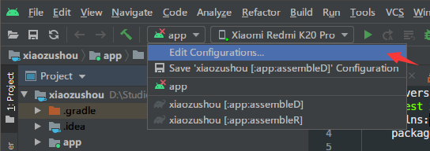
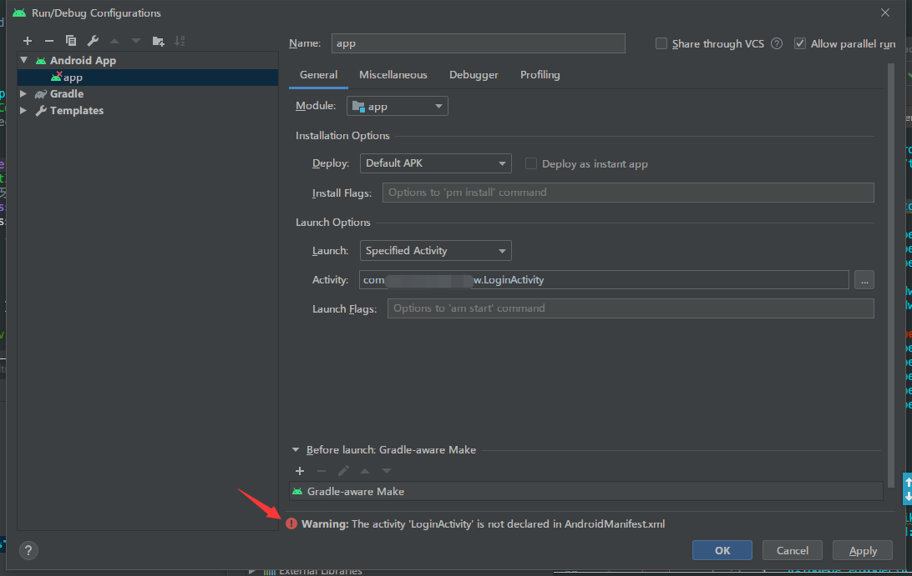
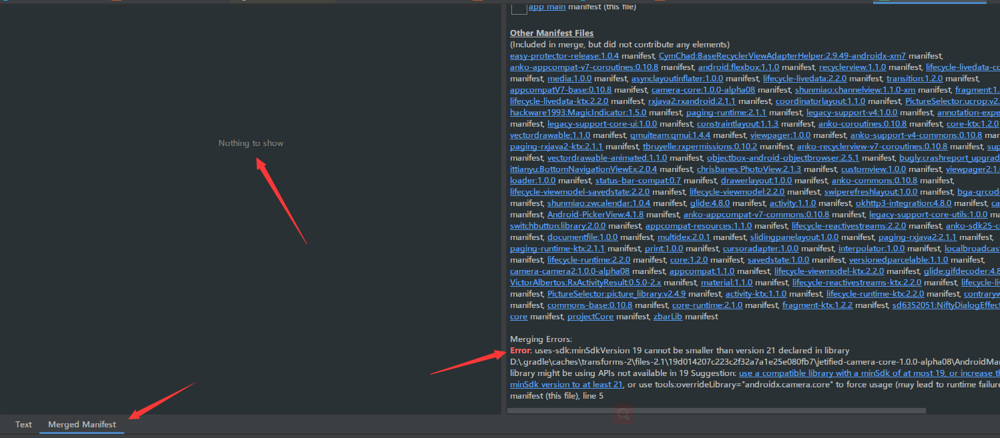

  大家在用Android Studio的时候可能都遇到过一种情况,点击运行app,as提示"Default Activity not found",出现这种情况的原因是多种多样的,有时候能在as的报错中找到相关信息,有时候却找不到,让人很烦恼.一时找不到原因的情况下,可以按照下面的方法进行尝试.

## 解决尝试

1. 有的时候clean项目重新build就能解决了,有时候却不能.

2. 点击 <kbd>File</kbd> -><kbd>Invalidate Caches /Restart</kbd>清除个人目录下的项目缓存,或则直接删除`C:\Users\userName\.AndroidStudio4.0\system`的文件夹,注意config文件夹不要删除,否则as的一些个性化设置就丢失了.

3. 尝试命令行构建,在项目的根目录下打开命令行执行`gradle :app:assembleD -i -s`看能否构建成功,或者从构建的输出中能不能找到错误的相关信息.如果是使用的默认的gradle wrapper 的话,命令中的gradle要改成gradlew:`.\gradlew.bat :app:assembleD -i -s`.

4. 直接指定要启动的activity:

    

    在弹出的Configurations对话框的Launch中选择Specified Activity,在Activity中选择要启动的Activity:
    
    图中选择了以后,提示该activity不在清单中,但是检查清单,这个activity当然是声明了的.这时候很可能的情况就是清单合并失败了.

    

5. 检查清单合并,打开app module的清单文件,点击清单窗口左下↙的Merged Manifest:

    

    可以看到,左边并没有显示合并后的清单,右边也显示了合并出错的原因,只要解决相应的问题,左边就会显示合并后的清单文件,也就能正常启动build进行安装了.

    

